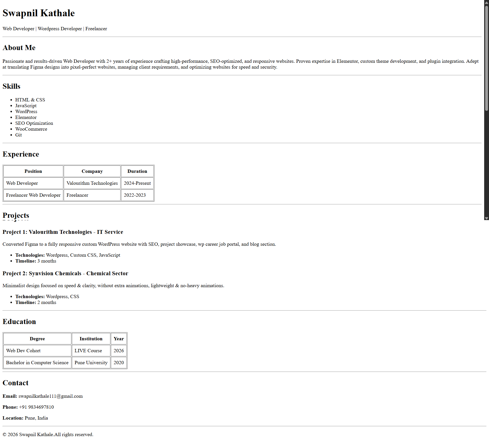

# HTML Resume Page Assignment Project
<h6>Date: 30-01-26</h6>

This project is a **single-page resume page built using only HTML**.  
No CSS or JavaScript has been used.  
The main focus of this assignment is to understand **HTML structure, semantics, readability, and layout clarity**.

--- 

Project Livelink -> `http://swapnilkathale.in/`

---

### Project Objective

- Practice **pure HTML**
- Understand **semantic HTML tags**
- Create a readable and well-structured resume layout
- Build UI without using CSS
- Follow professional project and naming standards

---

### Project Structure

```yml
html-resume-page/
│
├── screenshots/
├── index.html
└── README.md
```

---

### Technologies Used

- HTML
- Visual Studio Code
- Live Server

---

### How to Run the Project

#### Open Directly
1. Download or clone the repository
2. Open `index.html`
3. Open with any browser

> OR

#### Using VS Code Live Server
1. Open the project folder in VS Code
2. Right-click on `index.html`
3. Click **"Open with Live Server"**

---

### Sections Included

- Header (Heading)
- About Me (Subheading, Paragraph)
- Skills (Unordered List)
- Experience (Table)
- Projects (Unordered List)
- Education (Table)
- Contact (Paragraphs)
- Footer (Paragraph)

---

### Focus Areas

- UI layout and structure
- Spacing and alignment using HTML elements
- Visual clarity without CSS
- Proper use of semantic HTML tags
- Readability and clean formatting

---

### Screenshots

Add screenshots inside the `screenshots` folder.




---

Project Livelink -> `http://swapnilkathale.in/`


